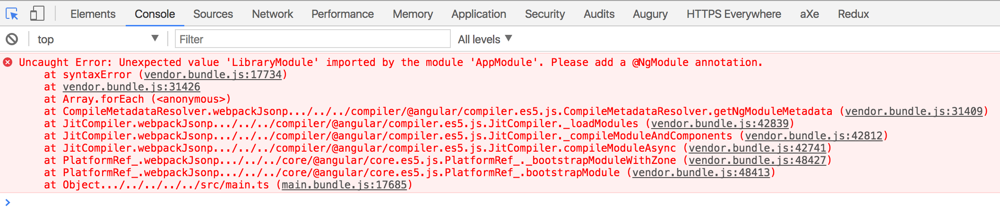
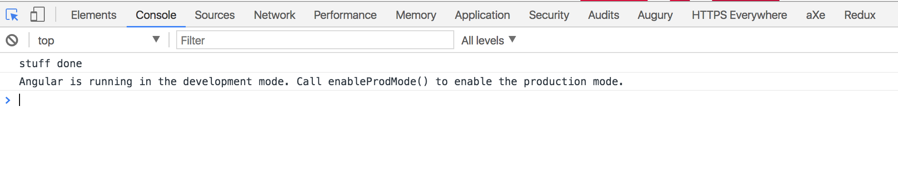

# Angular CLI with symlinked library issue reproduction

This repository is meant as a reproduction for an issue when using Angular CLI with a symlinked library.

Use case: a library with included demo application to showcase the library.

## The issue

The `@angular/core` package gets included twice, once for the app and once for the library. As such,
the app's JIT compiler cannot find the `@NgModule` annotation on the library's module.

The resulting error is:



## To reproduce

```bash
# install dependencies in library project
cd lib
npm i

# install dependencies in demo app
cd ../demo
npm i

# symlink library into node_modules
mkdir node_modules/@repro
cd node_modules/@repro
ln -s ../../../lib library
cd -

npm start
```

## Only in JIT

Running the demo app with AOT fixes the issue.

```bash
npm start -- --aot
```

We now get:



## Only in 1.3.0 and later

If we revert to `@angular/cli` version 1.2.x, we'll also get a working demo app.

```
npm i @angular/cli@1.2.x
npm start
```


